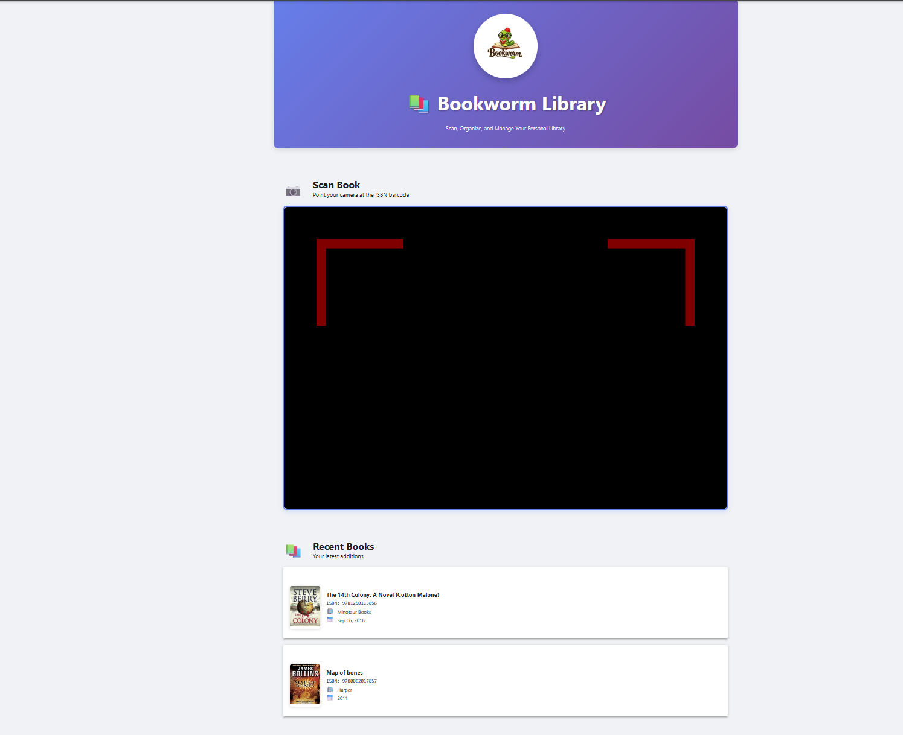
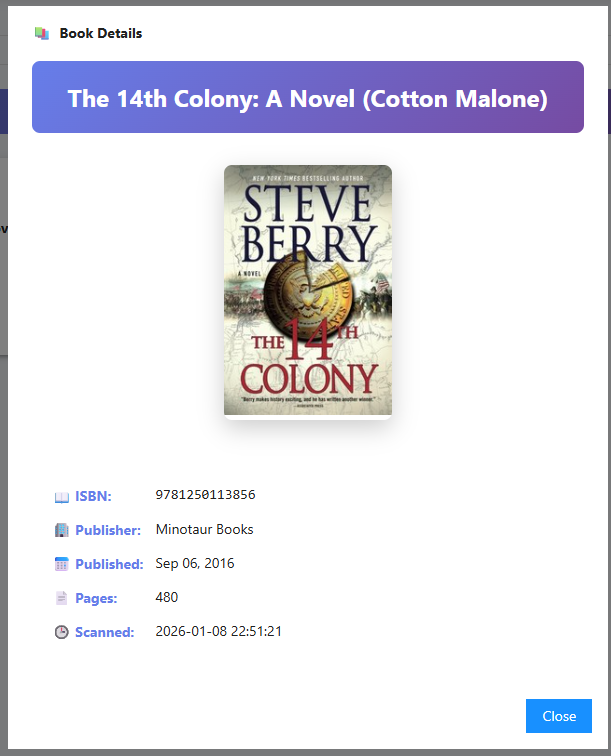
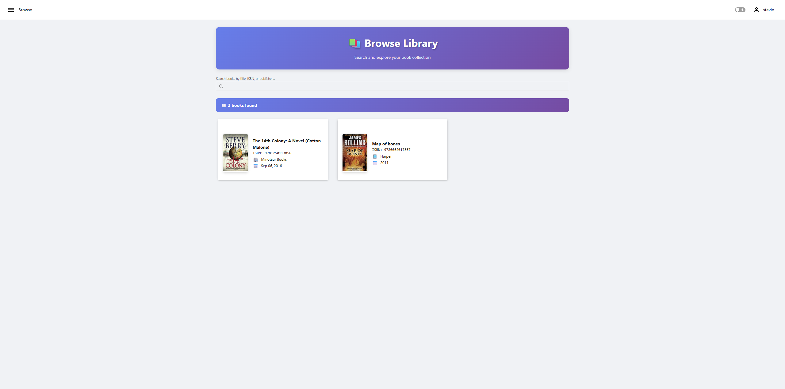

<p align="center">
  
</p>


## About

Bookworm is a PowerShell Universal app that turns your device into a personal library cataloging system. Simply point your camera at an ISBN barcode, and Bookworm will automatically fetch the book's metadata from the Open Library API and add it to your collection.

### Features

- 📷 **Barcode Scanner** - Use your device's camera to scan ISBN barcodes via [PowerShellUniversal.Component.BarcodeScanner](https://github.com/steviecoaster/PowerShellUniversal.Component.BarcodeScanner)
- 📖 **Automatic Metadata** - Fetches book details from Open Library (title, author, publisher, cover image, etc.)
- � **Browse & Search** - Browse your entire collection with real-time search filtering
- �🗄️ **SQLite Database** - Lightweight, portable storage for your book collection
- 🌙 **Dark Mode Support** - Looks great in both light and dark themes
- 📱 **Mobile Friendly** - Responsive design works on phones, tablets, and desktops

---

## Installation

### Prerequisites

- [PowerShell Universal](https://ironmansoftware.com/powershell-universal) v5.0 or later
- PowerShell 7.0+
- SQLite 3+

### Manual Steps

1. **Clone the repository**

   ```powershell
   git clone https://github.com/yourusername/PowerShellUniversal.Apps.Bookworm.git
   ```

2. **Copy the module to your PowerShell Universal modules folder**

   ```powershell
   Copy-Item -Path ".\PowerShellUniversal.Apps.Bookworm\PowerShellUniversal.Apps.Bookworm" -Destination "$env:ProgramData\UniversalAutomation\Repository\Modules\" -Recurse
   ```

   Or use the included sync script:

   ```powershell
   .\tools\Sync-InstalledModule.ps1 -SourcePath .\PowerShellUniversal.Apps.Bookworm\ -RestartService
   ```

### Within PowerShell Universal

1. Login to the PSU console
2. Navigate to Platform > Gallery
3. Search for PowerShellUniversal.Apps.Bookworm
4. Click Install
5. Navigate to yourpsuinstance/bookworm to access the app

---

## Usage

### Scanning Books

1. Navigate to the Bookworm app in your PowerShell Universal instance (_http(s)://yourpsuinstance/bookworm_)
2. Allow camera access when prompted
3. Point your camera at the ISBN barcode on the back of a book
4. The app will automatically:
   - Detect the barcode
   - Fetch book metadata from Open Library
   - Add the book to your collection
   - Display a success notification

### Viewing Your Library

- Recently scanned books appear in the "Recent Books" section on the Home page
- Click on any book to view detailed information including:
  - Cover image (when available)
  - ISBN
  - Publisher
  - Publication date
  - Page count
  - First sentence (when available)

### Browsing & Searching

- Navigate to the **Browse** page from the navigation menu
- View all books in your collection as a responsive grid of cards
- Use the search box to filter books by:
  - Title
  - ISBN
  - Publisher
- Click any book card to view full details in a modal

### Data Storage

Book data is stored in a SQLite database at:

- **Windows**: `C:\ProgramData\Bookworm\Bookworm.db`
- **Linux**: `~/Bookworm/Bookworm.db`

---

## Testing

Bookworm includes Playwright-based UI tests using the [PSPlaywright](https://github.com/adamdriscoll/psplaywright) PowerShell module.

### Setup

1. **Install prerequisites**

   ```powershell
   Install-Module -Name PSPlaywright -Scope CurrentUser
   Install-Module -Name Pester -Scope CurrentUser -MinimumVersion 5.0
   ```

2. **Install Playwright browsers**

   ```powershell
   .\tests\Setup-PlaywrightTests.ps1
   ```

### Running Tests

```powershell
# Run all tests with detailed output
.\tests\Invoke-BookwormTests.ps1

# Run against a different URL
.\tests\Invoke-BookwormTests.ps1 -BaseUrl 'https://yourpsuinstance/bookworm'

# Run with visible browser (non-headless)
.\tests\Invoke-BookwormTests.ps1 -Headless $false
```

### Test Coverage

- Homepage rendering and components
- Navigation between pages
- Browse page search functionality
- Book details modal interactions
- Dark mode compatibility

---

## Screenshots

### Home Page



### Book Details Modal



### Browse Page



---

## License

This project is licensed under the MIT License - see the [LICENSE](LICENSE) file for details.

## Acknowledgments

- Book metadata provided by [Open Library API](https://openlibrary.org/developers/api)
- Built with [PowerShell Universal](https://powershelluniversal.com)
